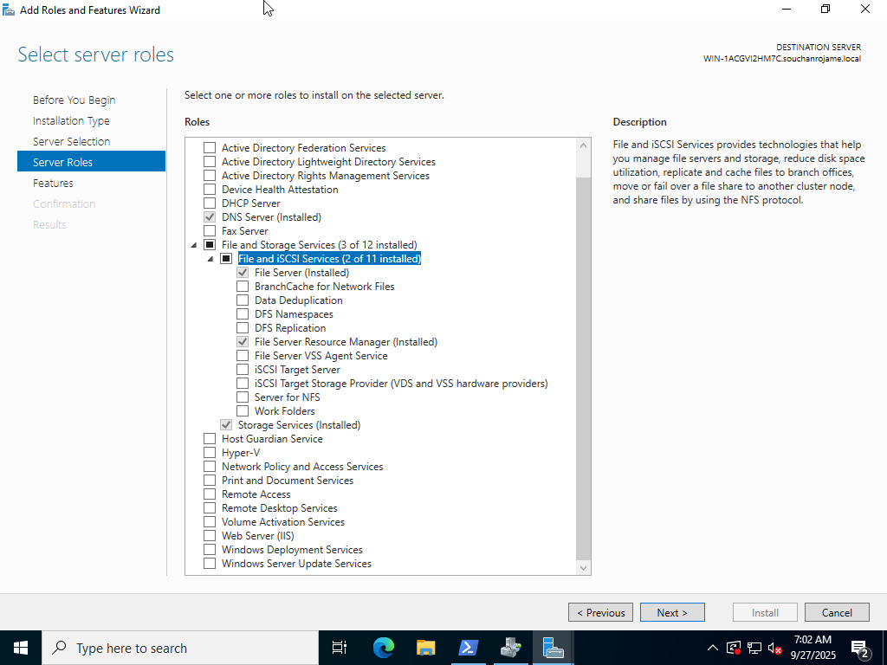
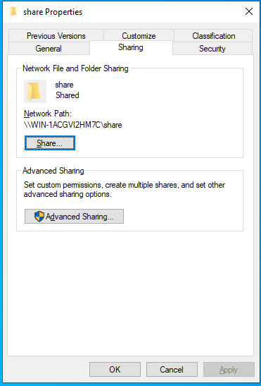
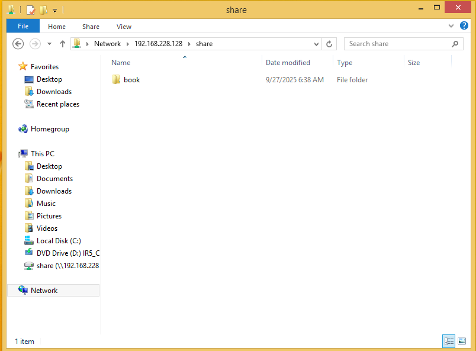
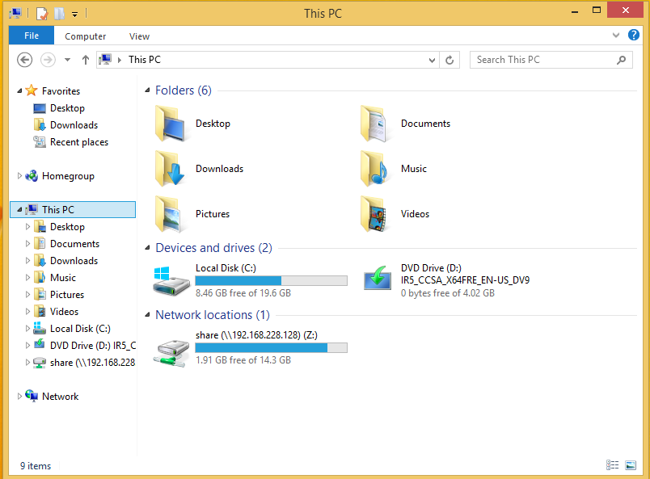

# File Server

## 🪄 **Step 1: Install the File Server Role**

1. Open **Server Manager**.
2. Click **Manage** → **Add Roles and Features**.
3. In the wizard:
   - Click **Next** until you reach **Server Roles**.
   - Expand **File and Storage Services** → **File and iSCSI Services**.
   - Check ✅ **File Server**.

4. Click **Next** → **Install**.
5. Wait for the installation to complete, then click **Close**.



---

## 📁 **Step 2: Create a Shared Folder**

1. Create a folder on a disk (e.g., `C:\Users\Administrator\Desktop\share`).
2. Right-click the folder → **Properties** → **Sharing** tab.
3. Click **Advanced Sharing**.
   - Check ✅ **Share this folder**.
   - Set **Share name** (e.g., `share`).
   - Click **Permissions** → Add users/groups or give **Everyone** Read/Write if needed.

4. Click **OK** on all dialogs.
   

## 🌐 **Step 3: Access the Share from a Client**

On another computer in the same network:

- Open **File Explorer**.
- In the address bar, type:

  ```
  \\<ServerName>\share
  ```

  or by IP:

  ```
  \\192.168.1.10\share
  ```

You should now see the folder content.
If prompted for credentials, enter a valid user account from the server.


---

## 🔄 **Step 4 (Optional): Map a Network Drive**

To make it persistent on the client machine:

1. In File Explorer → **This PC** → **Map network drive**.
2. Choose a drive letter, and enter:

   ```
   \\<ServerName>\share
   ```

3. Check ✅ **Reconnect at sign-in**.
4. Click **Finish**.
